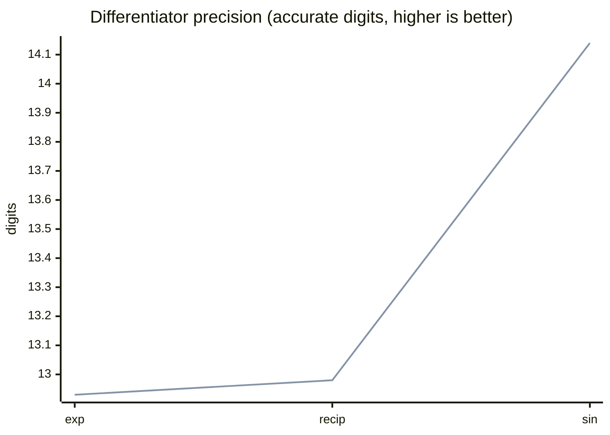
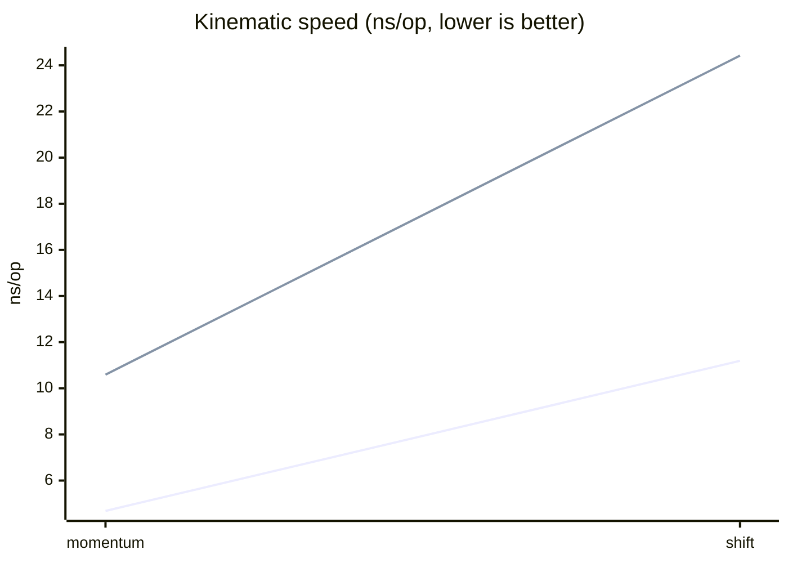
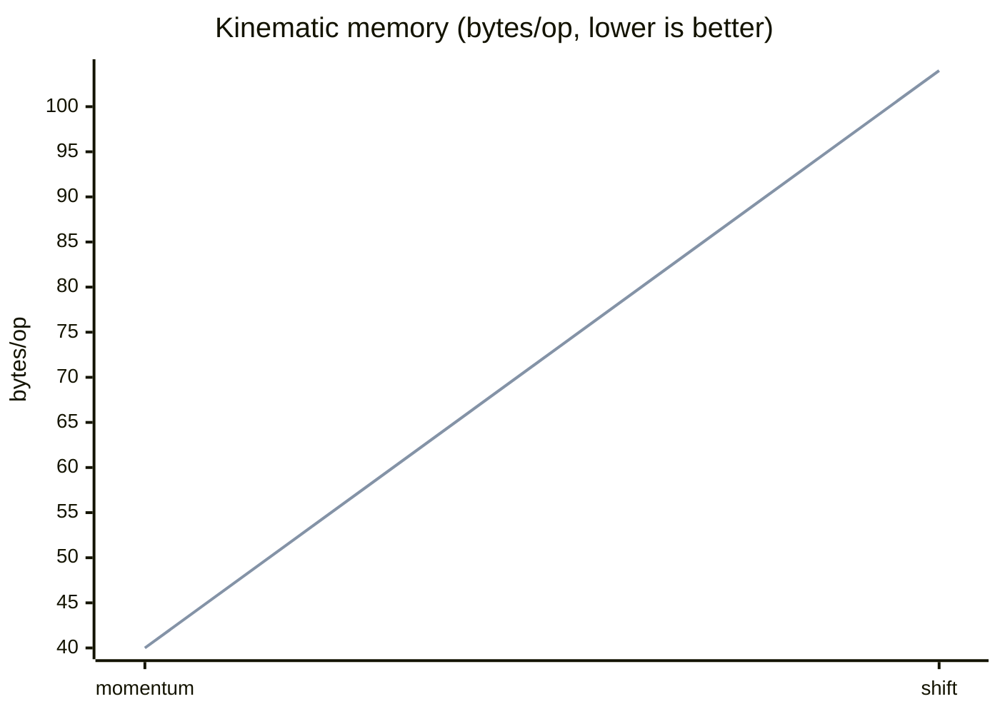
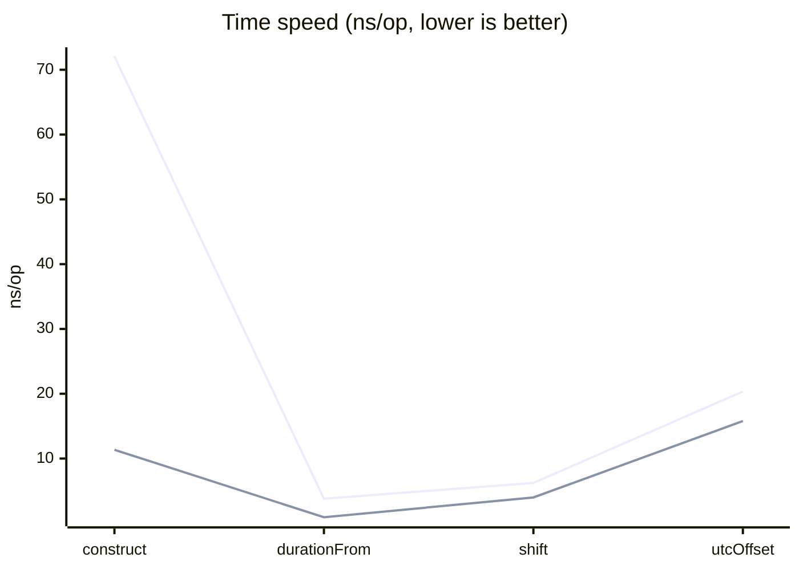
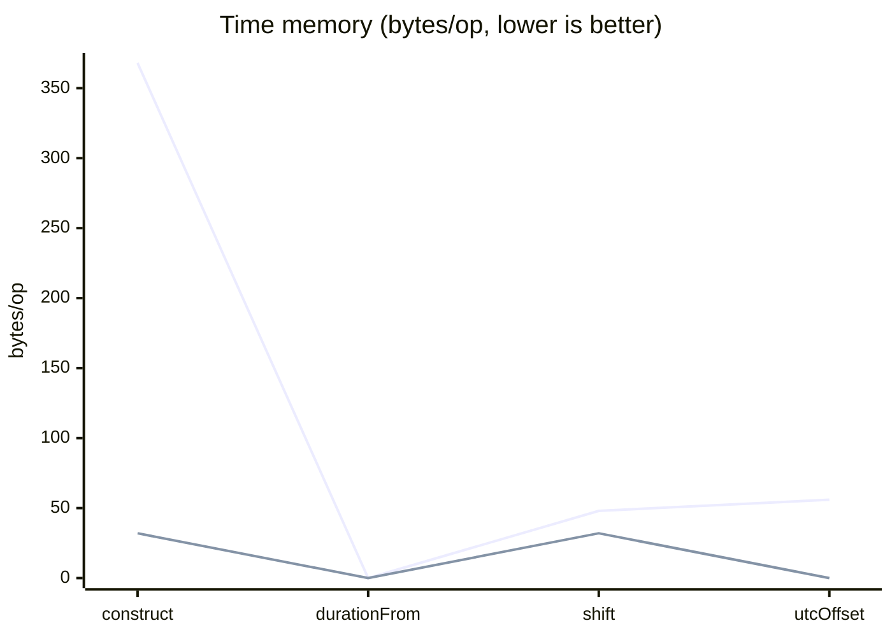
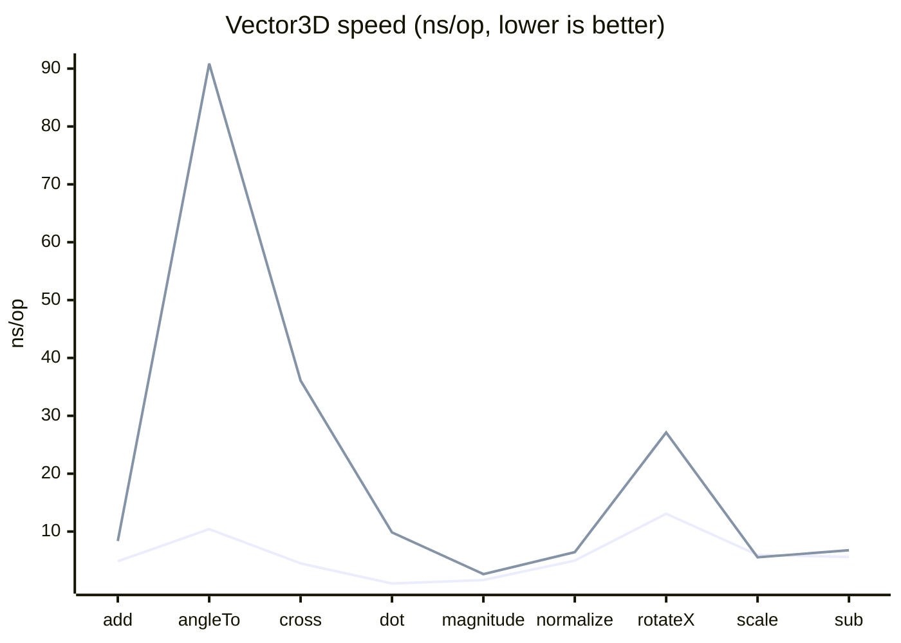
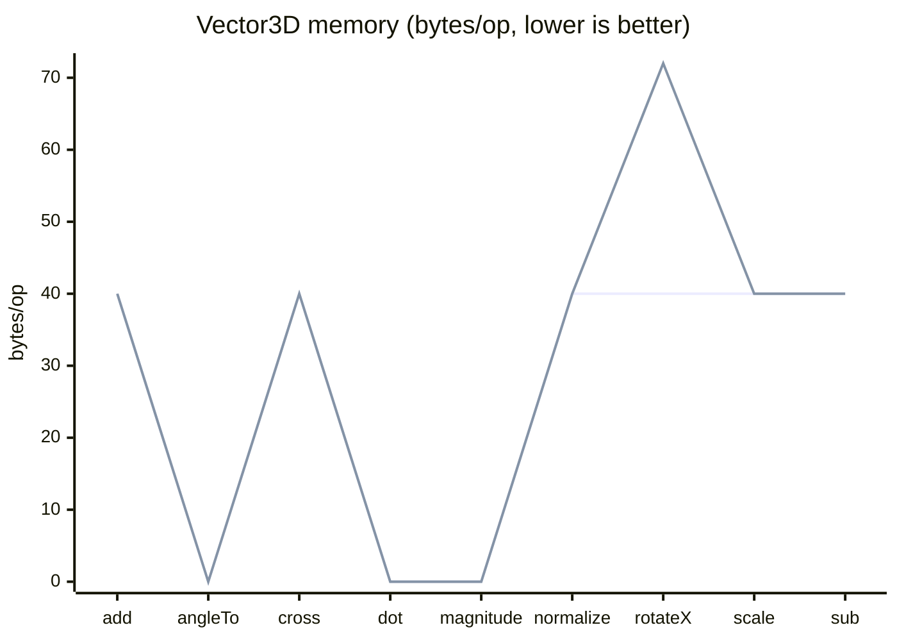
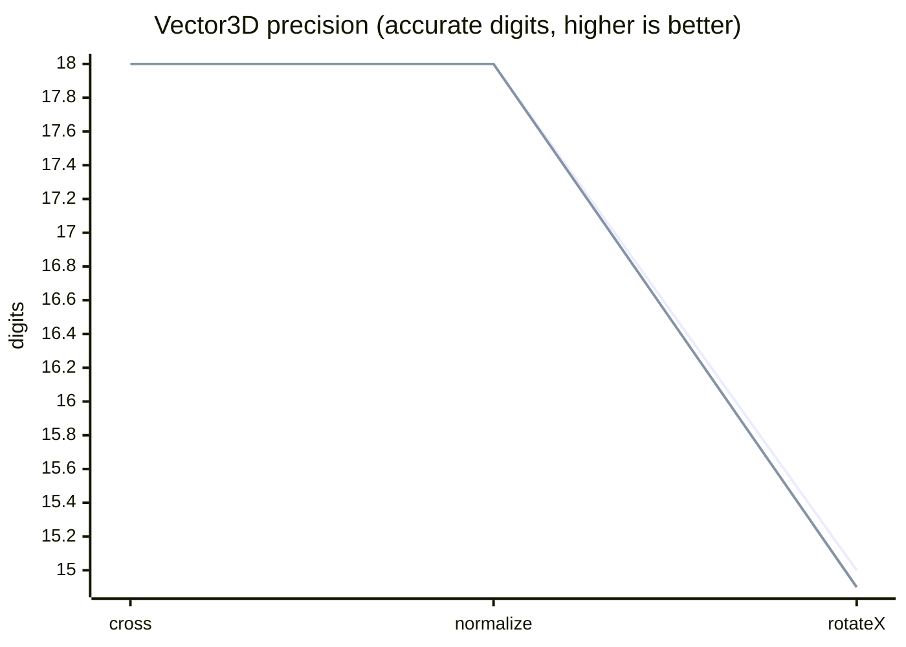

# New Frontiers vs Orekit/Hipparchus benchmark baseline

Lower is better for speed and memory; higher is better for precision. Every chart has two
lines, New Frontiers first and Orekit/Hipparchus second. Speed (ns/op) and memory (bytes/op)
come from JMH. Precision is shown as accurate decimal digits, `-log10(absolute error)`, capped
at 18; a point at 18 means the result was exact. Regenerate with `sbt benchAll`.

## Differentiator

### Performance and memory

```mermaid
xychart-beta
    title "Differentiator speed (ns/op, lower is better)"
    x-axis ["firstDerivative"]
    y-axis "ns/op"
    line [228.5]
    line [306.2]
```
*First line: New Frontiers. Second line: Orekit/Hipparchus.*

```mermaid
xychart-beta
    title "Differentiator memory (bytes/op, lower is better)"
    x-axis ["firstDerivative"]
    y-axis "bytes/op"
    line [736]
    line [1088]
```
*First line: New Frontiers. Second line: Orekit/Hipparchus.*

### Precision


*First line: New Frontiers. Second line: Orekit/Hipparchus.*

## Kinematic

### Performance and memory


*First line: New Frontiers. Second line: Orekit/Hipparchus.*


*First line: New Frontiers. Second line: Orekit/Hipparchus.*

### Precision

```mermaid
xychart-beta
    title "Kinematic precision (accurate digits, higher is better)"
    x-axis ["propagate_120s"]
    y-axis "digits"
    line [18]
    line [14.45]
```
*First line: New Frontiers. Second line: Orekit/Hipparchus.*

## Time

### Performance and memory


*First line: New Frontiers. Second line: Orekit/Hipparchus.*


*First line: New Frontiers. Second line: Orekit/Hipparchus.*

### Precision

```mermaid
xychart-beta
    title "Time precision (accurate digits, higher is better)"
    x-axis ["accumulate_0.1s_x10M"]
    y-axis "digits"
    line [18]
    line [10]
```
*First line: New Frontiers. Second line: Orekit/Hipparchus.*

## Vector3D

### Performance and memory


*First line: New Frontiers. Second line: Orekit/Hipparchus.*


*First line: New Frontiers. Second line: Orekit/Hipparchus.*

### Precision


*First line: New Frontiers. Second line: Orekit/Hipparchus.*

