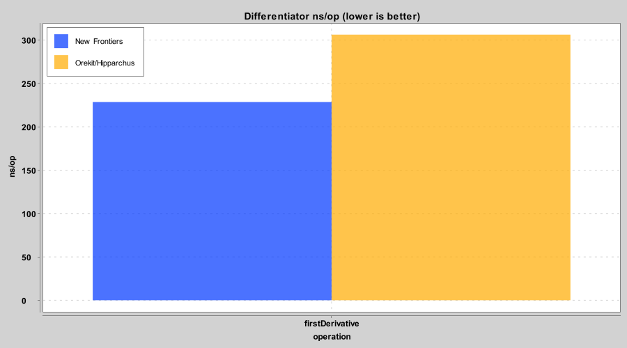
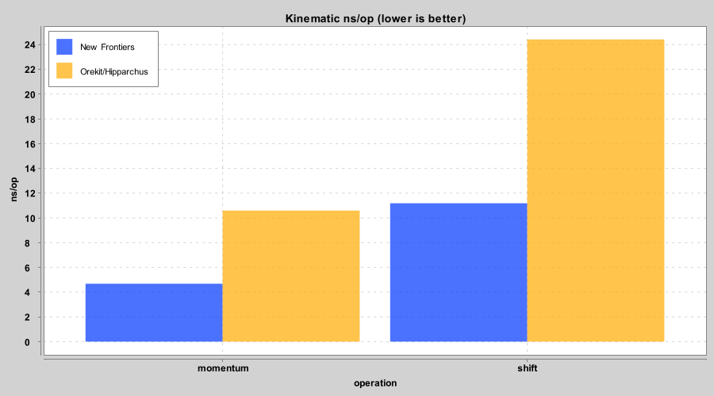
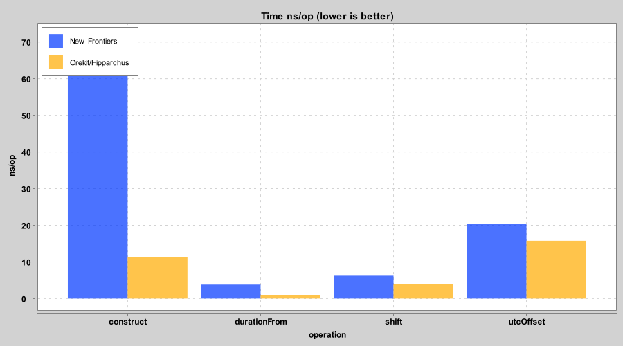
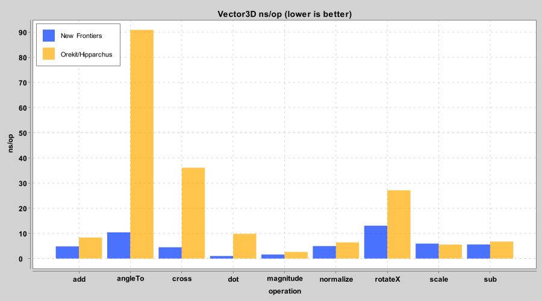

# New Frontiers vs Orekit/Hipparchus benchmark baseline

`nf` is New Frontiers, `ok` is Orekit/Hipparchus. Lower is better in every column.
ns/op comes from JMH AverageTime, B/op from the JMH GC profiler (`gc.alloc.rate.norm`), and error is the absolute distance from an analytic or known value. `speed x` is ok ns/op divided by nf ns/op, so above 1 means NF is faster.

## Differentiator

### Speed and memory

| op | nf ns/op | ok ns/op | speed x | nf B/op | ok B/op |
|----|---------:|---------:|--------:|--------:|--------:|
| firstDerivative | 228.512 | 306.225 | 1.34 | 736.002 | 1088.002 |

### Precision (absolute error from an analytic or known value)

| op | nf err | ok err |
|----|-------:|-------:|
| exp | 1.181e-13 | 1.186e-13 |
| recip | 1.055e-13 | 1.057e-13 |
| sin | 7.216e-15 | 7.216e-15 |

## Kinematic

### Speed and memory

| op | nf ns/op | ok ns/op | speed x | nf B/op | ok B/op |
|----|---------:|---------:|--------:|--------:|--------:|
| momentum | 4.683 | 10.592 | 2.26 | 40.000 | 40.000 |
| shift | 11.186 | 24.418 | 2.18 | 104.000 | 104.000 |

### Precision (absolute error from an analytic or known value)

| op | nf err | ok err |
|----|-------:|-------:|
| propagate_120s | 0 | 3.553e-15 |

## Time

### Speed and memory

| op | nf ns/op | ok ns/op | speed x | nf B/op | ok B/op |
|----|---------:|---------:|--------:|--------:|--------:|
| construct | 72.075 | 11.347 | 0.16 | 368.000 | 32.000 |
| durationFrom | 3.801 | 0.935 | 0.25 | 2.595e-05 | 6.380e-06 |
| shift | 6.231 | 3.995 | 0.64 | 48.000 | 32.000 |
| utcOffset | 20.354 | 15.789 | 0.78 | 56.000 | 1.074e-04 |

### Precision (absolute error from an analytic or known value)

| op | nf err | ok err |
|----|-------:|-------:|
| accumulate_0.1s_x10M | 0 | 1.000e-10 |

## Vector3D

### Speed and memory

| op | nf ns/op | ok ns/op | speed x | nf B/op | ok B/op |
|----|---------:|---------:|--------:|--------:|--------:|
| add | 4.858 | 8.373 | 1.72 | 40.000 | 40.000 |
| angleTo | 10.416 | 90.874 | 8.72 | 7.103e-05 | 6.162e-04 |
| cross | 4.496 | 36.091 | 8.03 | 40.000 | 40.000 |
| dot | 1.019 | 9.853 | 9.67 | 6.944e-06 | 6.716e-05 |
| magnitude | 1.626 | 2.648 | 1.63 | 1.111e-05 | 1.802e-05 |
| normalize | 4.979 | 6.442 | 1.29 | 40.000 | 40.000 |
| rotateX | 13.080 | 27.124 | 2.07 | 40.000 | 72.000 |
| scale | 5.957 | 5.559 | 0.93 | 40.000 | 40.000 |
| sub | 5.605 | 6.763 | 1.21 | 40.000 | 40.000 |

### Precision (absolute error from an analytic or known value)

| op | nf err | ok err |
|----|-------:|-------:|
| cross | 0 | 0 |
| normalize | 0 | 0 |
| rotateX | 9.930e-16 | 1.256e-15 |

