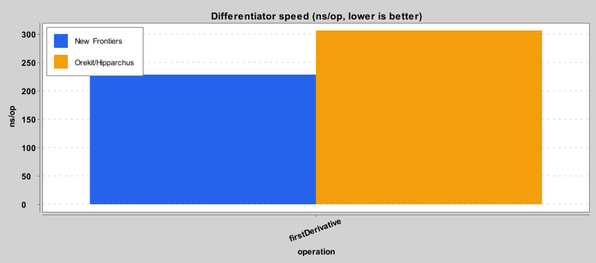
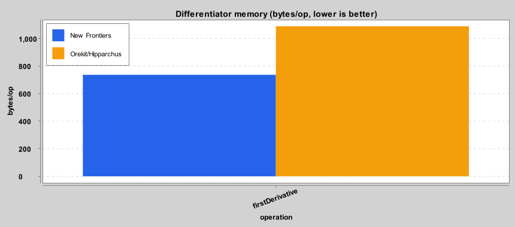
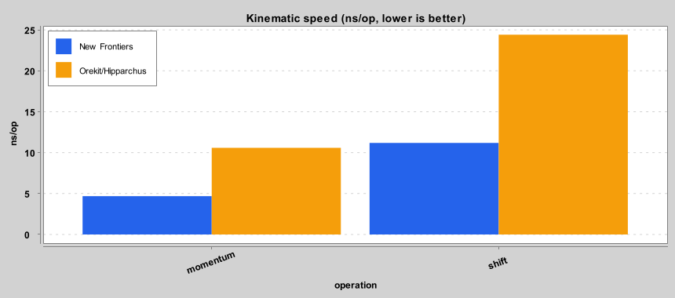
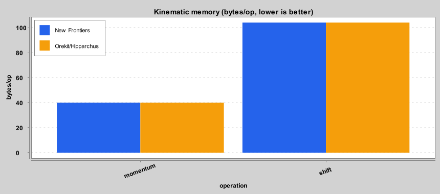
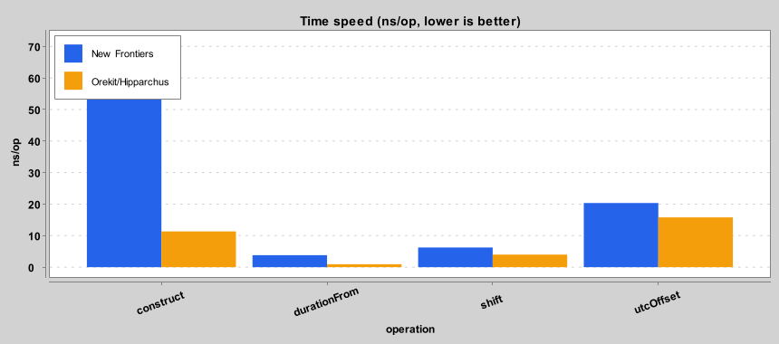
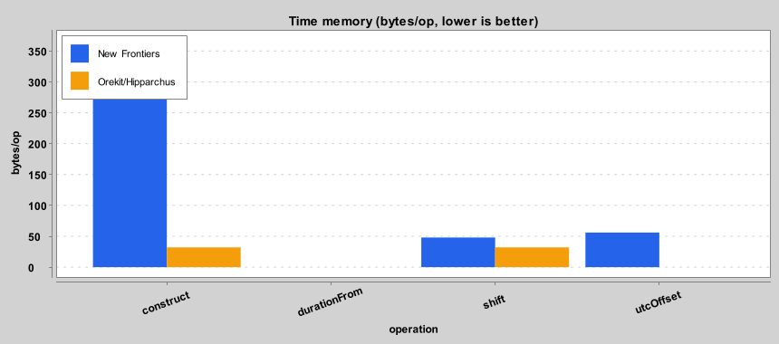
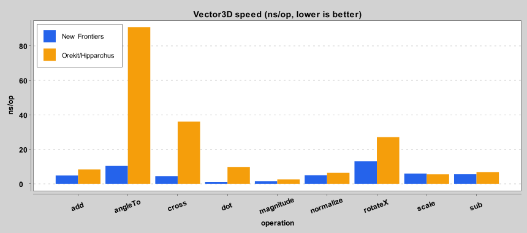
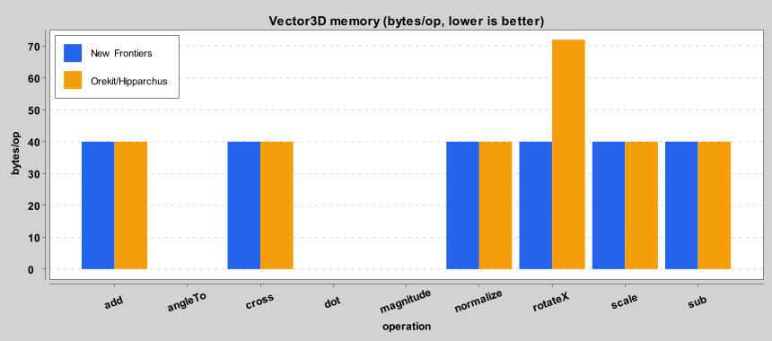

# New Frontiers vs Orekit/Hipparchus benchmark baseline

Each chart compares New Frontiers (blue) and Orekit/Hipparchus (amber) per operation;
lower bars are better. Speed (ns/op) and memory (bytes/op) come from JMH. Precision is left
as a table, since errors span many orders of magnitude and an exact result has zero error,
which does not plot well. The tables also give the plain NF-to-Orekit ratio. Regenerate with `sbt benchAll`.

## Differentiator

### Performance and memory

| op | NF ns/op | Orekit ns/op | speed | NF B/op | Orekit B/op | memory |
|----|---------:|-------------:|------:|--------:|------------:|-------:|
| firstDerivative | 228.512 | 306.225 | 1.34× | 736.002 | 1088.002 | 1.48× |

### Precision

| op | NF error | Orekit error | accuracy |
|----|---------:|-------------:|---------:|
| exp | 1.18e-13 | 1.19e-13 | 1.00× |
| recip | 1.06e-13 | 1.06e-13 | 1.00× |
| sin | 7.22e-15 | 7.22e-15 | 1.00× |

## Kinematic

### Performance and memory

| op | NF ns/op | Orekit ns/op | speed | NF B/op | Orekit B/op | memory |
|----|---------:|-------------:|------:|--------:|------------:|-------:|
| momentum | 4.683 | 10.592 | 2.26× | 40.000 | 40.000 | 1.00× |
| shift | 11.186 | 24.418 | 2.18× | 104.000 | 104.000 | 1.00× |

### Precision

| op | NF error | Orekit error | accuracy |
|----|---------:|-------------:|---------:|
| propagate_120s | 0 (exact) | 3.55e-15 | 3553× |

## Time

### Performance and memory

| op | NF ns/op | Orekit ns/op | speed | NF B/op | Orekit B/op | memory |
|----|---------:|-------------:|------:|--------:|------------:|-------:|
| construct | 72.075 | 11.347 | 0.16× | 368.000 | 32.000 | 0.09× |
| durationFrom | 3.801 | 0.935 | 0.25× | 2.60e-05 | 6.38e-06 | 1.00× |
| shift | 6.231 | 3.995 | 0.64× | 48.000 | 32.000 | 0.67× |
| utcOffset | 20.354 | 15.789 | 0.78× | 56.000 | 1.07e-04 | 0.02× |

### Precision

| op | NF error | Orekit error | accuracy |
|----|---------:|-------------:|---------:|
| accumulate_0.1s_x10M | 0 (exact) | 1.00e-10 | 100000000× |

## Vector3D

### Performance and memory

| op | NF ns/op | Orekit ns/op | speed | NF B/op | Orekit B/op | memory |
|----|---------:|-------------:|------:|--------:|------------:|-------:|
| add | 4.858 | 8.373 | 1.72× | 40.000 | 40.000 | 1.00× |
| angleTo | 10.416 | 90.874 | 8.72× | 7.10e-05 | 6.16e-04 | 1.00× |
| cross | 4.496 | 36.091 | 8.03× | 40.000 | 40.000 | 1.00× |
| dot | 1.019 | 9.853 | 9.67× | 6.94e-06 | 6.72e-05 | 1.00× |
| magnitude | 1.626 | 2.648 | 1.63× | 1.11e-05 | 1.80e-05 | 1.00× |
| normalize | 4.979 | 6.442 | 1.29× | 40.000 | 40.000 | 1.00× |
| rotateX | 13.080 | 27.124 | 2.07× | 40.000 | 72.000 | 1.80× |
| scale | 5.957 | 5.559 | 0.93× | 40.000 | 40.000 | 1.00× |
| sub | 5.605 | 6.763 | 1.21× | 40.000 | 40.000 | 1.00× |

### Precision

| op | NF error | Orekit error | accuracy |
|----|---------:|-------------:|---------:|
| cross | 0 (exact) | 0 (exact) | 1.00× |
| normalize | 0 (exact) | 0 (exact) | 1.00× |
| rotateX | 9.93e-16 | 1.26e-15 | 1.26× |

